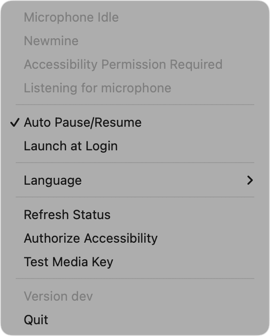
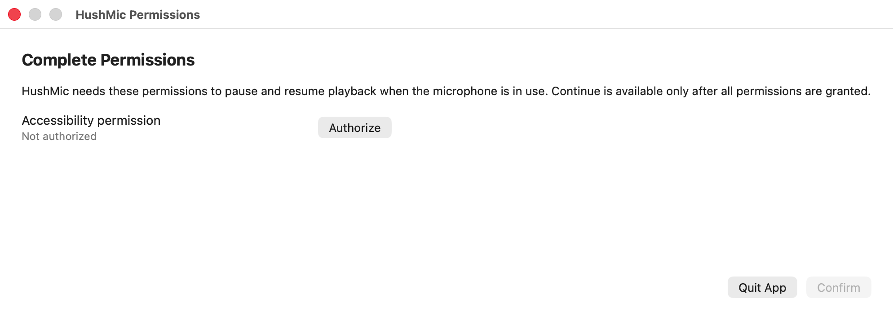

# HushMic

[中文](README.zh-CN.md)

HushMic is a lightweight macOS menu bar utility that watches microphone activity and keeps your media playback out of the way. When the microphone becomes active, it can pause the currently playing media. When the microphone becomes idle again, it only resumes media playback that HushMic paused.

HushMic is written in Swift as a Swift Package Manager executable. It uses AppKit for the menu bar app shell and permission window, SwiftUI for menu UI, CoreAudio for microphone activity detection, ServiceManagement for launch-at-login registration, and AppleScript/media keys for playback control.

## Why

HushMic was built for Vibe Coding workflows, especially when using tools like Codex or Claude Code with speech-to-text to talk to an AI model while coding. If music or a podcast keeps playing in the background, that audio can leak into the microphone and reduce transcription quality. HushMic removes that friction by pausing playback while the microphone is in use, then restoring only the media playback it paused.

## Screenshots

| Menu | Permissions |
| --- | --- |
|  |  |

## What It Does

- Shows the current microphone state from the macOS menu bar.
- Detects active input devices through CoreAudio.
- Automatically pauses media when microphone input starts.
- Restores only media playback that HushMic paused.
- Supports Music, Spotify, and iTunes through AppleScript playback state checks.
- Uses media key control for supported players that do not expose a reliable playback state.
- Provides English, Simplified Chinese, and automatic language selection.
- Can register the packaged app as a macOS login item.

## Requirements

- macOS 14 or later.
- Swift 5.9 toolchain from Xcode or Xcode Command Line Tools.

## Build

Compile the SwiftPM executable:

```bash
swift build
```

Build and package the app into `dist/HushMic.app`:

```bash
./script/build_and_run.sh --package
```

Build, package, and open the app:

```bash
./script/build_and_run.sh
```

Build, package, launch, and verify the process started:

```bash
./script/build_and_run.sh --verify
```

## Development Commands

```bash
./script/build_and_run.sh --logs
```

Streams logs for the `HushMic` process.

```bash
./script/build_and_run.sh --telemetry
```

Streams logs for subsystem `com.location.HushMic`.

```bash
./script/build_and_run.sh --debug
```

Runs the packaged binary under `lldb`.

## Permissions

HushMic needs Accessibility permission to send media key events. When controlling Music, Spotify, or iTunes directly, macOS may also show an Automation permission prompt.

The app intentionally avoids toggling playback when it cannot confirm the current playback state. macOS does not expose one public, universal API for pausing every possible media app, so HushMic prefers skipping automation over accidentally starting audio that was already paused.

## Launch at Login

The "Launch at Login" menu item registers the packaged `dist/HushMic.app` bundle as a macOS login item. Use `./script/build_and_run.sh` before testing this flow so the app is running from a real `.app` bundle.

## License

HushMic is available under the [MIT License](LICENSE).
