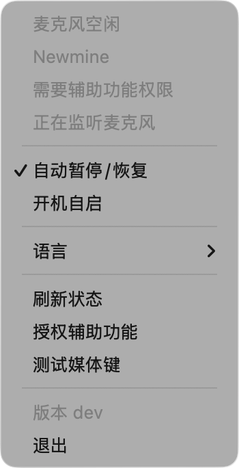
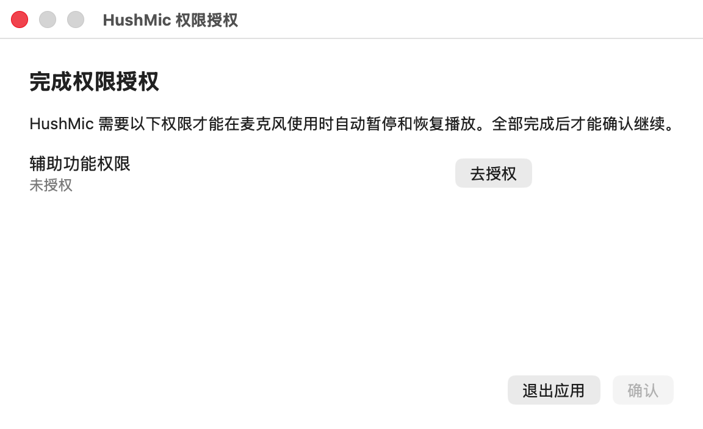

# HushMic

[English](README.md)

HushMic 是一个轻量的 macOS 菜单栏工具，用来监听麦克风是否正在被使用，并在你开始说话、开会、录音时处理媒体播放。麦克风开始使用时，它可以暂停当前正在播放的媒体；麦克风停止使用后，它只恢复自己暂停过的媒体播放。

HushMic 使用 Swift 编写，是一个 Swift Package Manager 可执行目标。它使用 AppKit 搭建菜单栏应用外壳和权限窗口，使用 SwiftUI 构建菜单界面，使用 CoreAudio 监听麦克风状态，使用 ServiceManagement 注册开机自启，并通过 AppleScript 或媒体键控制播放。

## 为什么做这个工具

HushMic 的使用场景来自 Vibe Coding：在使用 Codex、Claude Code 这类工具写代码时，经常会通过麦克风做语音转文字，直接和模型交流。如果这时音乐或播客还在播放，播放器声音会干扰麦克风收音，也会影响转写质量。HushMic 的目标就是把这一步自动化，只在麦克风使用期间暂停播放，并在麦克风空闲后恢复自己暂停过的媒体播放。

## 截图

| 菜单 | 权限 |
| --- | --- |
|  |  |

## 它能做什么

- 在 macOS 菜单栏显示当前麦克风状态。
- 通过 CoreAudio 检测正在使用的输入设备。
- 麦克风开始输入时自动暂停媒体播放。
- 麦克风空闲后，只恢复 HushMic 自己暂停过的媒体播放。
- 通过 AppleScript 读取并控制 Music、Spotify、iTunes 的播放状态。
- 对无法可靠读取播放状态的播放器，使用媒体键进行兼容控制。
- 支持英文、简体中文和自动语言选择。
- 可以把打包后的应用注册为 macOS 登录项。

## 环境要求

- macOS 14 或更高版本。
- Swift 5.9 工具链，可通过 Xcode 或 Xcode Command Line Tools 安装。

## 构建

编译 SwiftPM 可执行目标：

```bash
swift build
```

构建并打包为 `dist/HushMic.app`：

```bash
./script/build_and_run.sh --package
```

构建、打包并打开应用：

```bash
./script/build_and_run.sh
```

构建、打包、启动，并确认进程已运行：

```bash
./script/build_and_run.sh --verify
```

## 安装未签名版本

如果 macOS 提示应用“已损坏”，可以把 `HushMic.app` 移到 `/Applications`，然后执行：

```bash
xattr -dr com.apple.quarantine /Applications/HushMic.app
```

## 开发命令

```bash
./script/build_and_run.sh --logs
```

查看 `HushMic` 进程日志。

```bash
./script/build_and_run.sh --telemetry
```

查看 subsystem 为 `com.location.HushMic` 的日志。

```bash
./script/build_and_run.sh --debug
```

使用 `lldb` 运行打包后的二进制文件。

## 权限说明

HushMic 需要辅助功能权限来发送媒体键事件。直接控制 Music、Spotify 或 iTunes 时，macOS 也可能弹出自动化权限请求。

如果无法确认当前播放状态，HushMic 会选择跳过自动控制。macOS 没有提供一个公开的通用 API 来暂停所有播放器，因此这里优先避免误把本来暂停的音频切换成播放。

## 开机自启

菜单里的”开机自启”会把打包后的 `dist/HushMic.app` 注册为 macOS 登录项。测试这个流程前请先运行 `./script/build_and_run.sh`，确保应用是从真实的 `.app` bundle 启动的。

## 许可证

HushMic 使用 [MIT 许可证](LICENSE) 开源。
